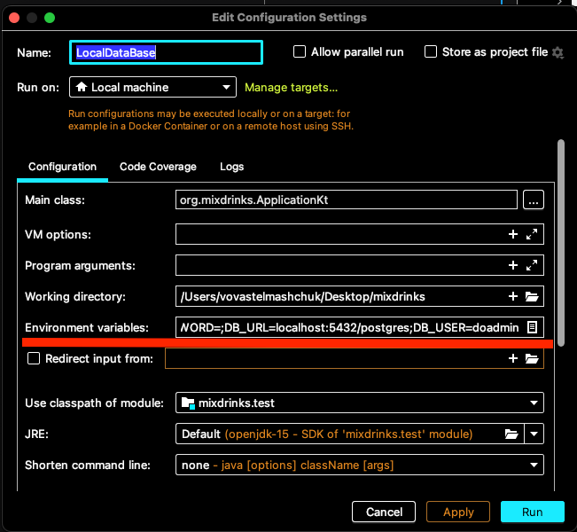

# Backend app documentation

## Install & Run

The app require the postgres database. Run the postgres database and provide the following environment variables:

* DB_URL - the url to data, include `sslmode=require` if your install of database needs it.
* DB_USER - the username. The user must have read access to all database
* DB_PASSWORD - the database password

### Deploy your own instance of service by digital ocean app platform

*Not stable*

### Docker

The repository has DockerFile, the file create fully ready docker image.

### Run as java app

Clone project and install java.

Build jar file
`gradle shadowJar`

Copy jar file to root
`cp build/libs/*.jar ktor-docker-sample.jar`

Start a java app
`java -jar src/build/libs/*.jar`

### Application settings

The app can configure by resources/application.conf

## Development

- Clone the repo.
- Set up the local postgres database
- Add environment variable, DB_URL, DB_USER, DB_PASSWORD, Check [Install & Run](#install--run) for more details.

### App tech stack

The app powered by [Ktor](https://ktor.io/) and [Kotlin](https://kotlinlang.org/). The app
use [Postgres](https://www.postgresql.org/) as database.
You can use [Docker](https://www.docker.com/) to run the app. App use Kotlin exposed for work with database.

### Tests

The app has tests. The test written in [Kotest](https://kotest.io/).
End-to-end tests verify user end flow. Mock the database and verify endpoint responses.
The unit tests verify the logic of the app.