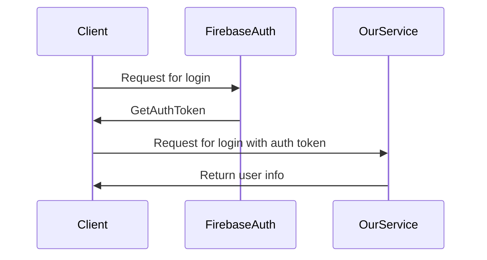

# Auth

The service support some authentication methods:

- Google
- Apple

### The auth flow

All requests to the service must contain the `Authorization` header with the `Bearer` prefix and the auth token.

Before start implement auth on your side check the [firebase auth docs](https://firebase.google.com/docs/auth)
