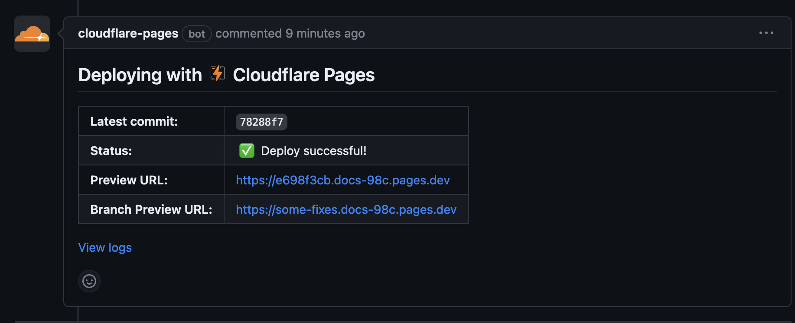

# Як працювати з документацією

### Простий варіант

Якщо ви хочете просто поправити опечатку або ж зробити інші мінорні зміни.

В низу кожної сторінки є кнопка `Edit this page` яка відкриває вас на GitHub в редакторі цієї сторінки. Ви можете
відредагувати сторінку прямо в браузері і надіслати зміни на розгляд. Далі стандартний процес роботи з GitHub.

** Fork -> Commit -> Pull Request. **

До кожного pull request CI створить новий сайт з вашими змінами і ви зможете перевірити чи все вірно.


Якщо все вірно, то ваші зміни будуть змерджені в головну гілку і відобразяться на сайті.

### Складніший варіант

Працюєте локально, ось їх [документація Docusaurus](https://docusaurus.io/docs/installation).
Вам треба тільки поставити NodeJs версії 16 або вище і виконати команди:

Скачування проєкту та підготовка залежностей, виконати лише один раз
```bash
npm install -g ngit clone https://github.com/MixDrinks/docs.git
cd docs
npm install 
```

Запуст тестового сервера
```bash
npx docusaurus start
```

Це підніме цей сайт локально на вашому комп'ютері і ви зможете працювати з ним як звичайно.
Address

**[http://localhost:3000](http://localhost:3000)**

//TODO: complete this section


