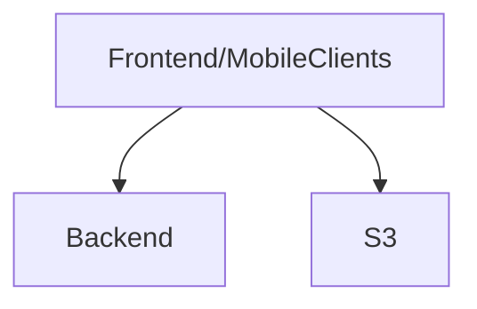

# Загальна архітектура 

Clients application -> Backend application -> Database
 
Backend хоститься це все на digital ocean, десь там і база даних.
[Тут](https://dou.ua/forums/topic/43201/) можна почитати чому зроблема імено так.

# Посилання на репозиторії

- [Web](https://github.com/MixDrinks/site) - nuxt js, vue, ...
- [Backend](https://github.com/MixDrinks/backend) - ktor, docker, ...
- [Mobile](https://github.com/MixDrinks/mobile) - kotlin multyplatform to compose by jetbrains
- [Andorid](https://github.com/MixDrinks/android) - kotlin, compose

Є не нулювий шанс до Android та Mobile буде з чосом змержено

## Діаграма

# Welcome to MixDrinks documentation

The project is a backend, frontend and mobile application for mixing drinks. The project provides an information about
drinks, cocktails and their ingredients.

## What is MixDrinks?

The MixDrinks creates by Ukrainians for Ukrainians. Our site provide a lot of information about cocktails his receipt,
and tools and goods which you need to prepare it.
The project is fully open source. You can use it for free. The project is not a commercial product.

You can find the source code on [GitHub](https://github.com/MixDrinks) and the site is available
on [MixDrinks](https://mixdrinks.org).

## Project status

- Supported API version: `v2`
- The project is in development phase. But all endpoints are available, working,tested and not be changed.
- The functionality is not fully implemented, we are working on it.
- The site will have a new pages such as all tools and all ingredients.
- The mobile application will be available soon.

## Contributing

* [Contribution](contribution.md)

The contribution guide for backend or site will be available soon.

